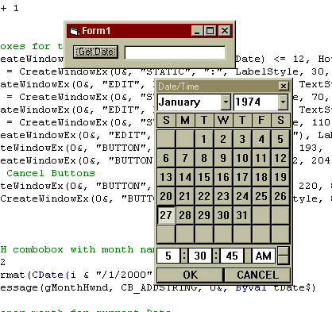



## SHOW DATE TIME CALENDAR DIALOG \- HOOKED API ONLY

### Description

FINALLY A FUNCTION THAT EVERONE CAN USE - Microsoft should have thought of this.

 

This is a DATE/TIME calendar dialog that is created using only native Windows API. (See ScreenShot) NO FORM NEEDED! It is used / called like any normal function.

EXAMPLE: MyText = ShowDate()

This will show the Date/Time Calendar and allow the user to select a date/time from a calendar / clock. 

You can also supply a 'default' date for the calendar to start at.

This is my first attempt at hooking with VB and researched all of the requirements online at the MSDN libraries.

Vote if you are so inclined. I would appreciate any comments or suggestions.

*AMPM bug fixed *sorry*

ENJOY
 
### More Info
 

             |
---                |---
**Submitted On**   |2001-05-01 16:10:16
**By**             |[Dave Andrews](https://github.com/Planet-Source-Code/PSCIndex/blob/master/ByAuthor/dave-andrews.md)
**Level**          |Advanced
**User Rating**    |4.2 (21 globes from 5 users)
**Compatibility**  |VB 5\.0, VB 6\.0
**Category**       |[Custom Controls/ Forms/  Menus](https://github.com/Planet-Source-Code/PSCIndex/blob/master/ByCategory/custom-controls-forms-menus__1-4.md)
**World**          |[Visual Basic](https://github.com/Planet-Source-Code/PSCIndex/blob/master/ByWorld/visual-basic.md)
**Archive File**   |[SHOW DATE 19085512001\.zip](https://github.com/Planet-Source-Code/dave-andrews-show-date-time-calendar-dialog-hooked-api-only__1-21994/archive/master.zip)

